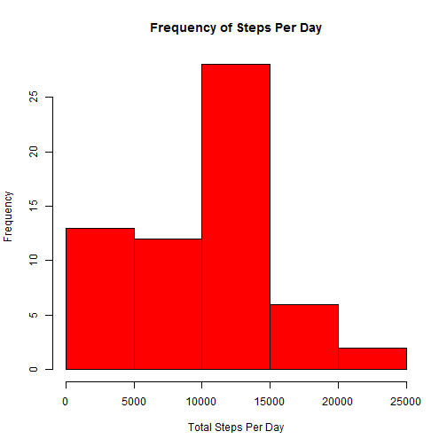
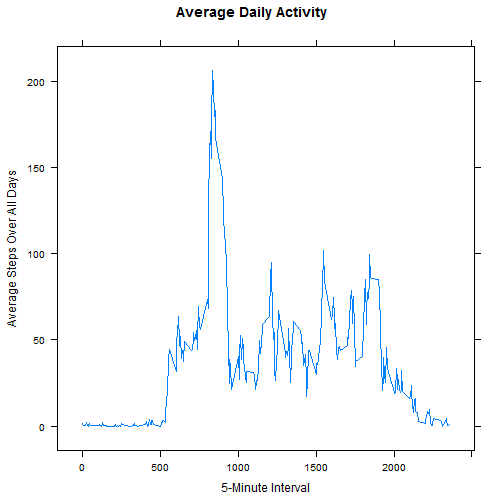
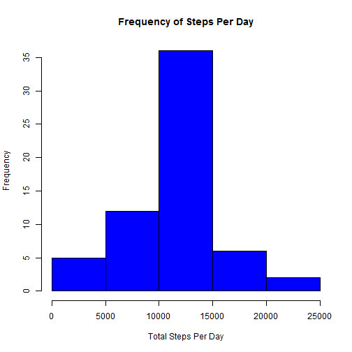
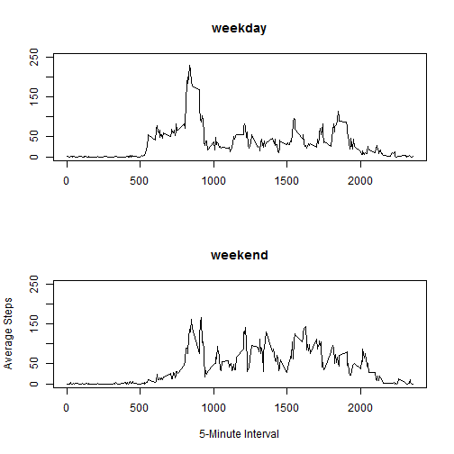

Reproducible Research: Peer Assessment 1
=================

------------

### Loading and preprocessing the data

1) Load the data

```r
data <- read.csv("activity.csv")
```

2) Process/transform the data

```r
stepsPerDay <- tapply(data$steps, data$date, FUN=sum, na.rm=TRUE)
averageStepsPerInterval <- tapply(data$steps, data$interval, FUN=mean, na.rm=TRUE)
```

### What is mean total number of steps taken per day?

1) Make a histogram of the total number of steps taken each day

```r
hist(stepsPerDay, main="Frequency of Steps Per Day", xlab="Total Steps Per Day", col="red")
```

 

2) Calculate and report the mean and median total number of steps taken per day

```r
mean(stepsPerDay, na.rm=TRUE)
```

```
## [1] 9354
```

```r
median(stepsPerDay, na.rm=TRUE)
```

```
## [1] 10395
```

### What is the average daily activity pattern?

1) Make a time series plot (i.e. type = "l") of the 5-minute interval (x-axis) and the average number of steps taken, averaged across all days (y-axis)


```r
library("lattice")
xyplot(averageStepsPerInterval~data$interval, type = "l", main="Average Daily Activity", xlab="5-Minute Interval", ylab="Average Steps Over All Days")
```

 

2) Which 5-minute interval, on average across all the days in the dataset, contains the maximum number of steps?


```r
data$interval[match(max(averageStepsPerInterval), averageStepsPerInterval)]
```

```
## [1] 835
```

### Imputing missing values

1) Calculate and report the total number of missing values in the dataset (i.e. the total number of rows with NAs)


```r
length(data$steps[is.na(data$steps)])
```

```
## [1] 2304
```

2) Devise a strategy for filling in all of the missing values in the dataset. The strategy does not need to be sophisticated. For example, you could use the mean/median for that day, or the mean for that 5-minute interval, etc.

*I will use the mean for the 5-minute interval to fill in the missing values*

3) Create a new dataset that is equal to the original dataset but with the missing data filled in.


```r
means <- tapply(data$steps, data$interval, FUN=mean, na.rm=TRUE)
data$steps[is.na(data$steps)] <- means[as.character(data$interval[is.na(data$steps)])]
```

4) Make a histogram of the total number of steps taken each day and Calculate and report the mean and median total number of steps taken per day.


```r
stepsPerDay <- tapply(data$steps, data$date, FUN=sum, na.rm=TRUE)
hist(stepsPerDay, main="Frequency of Steps Per Day", xlab="Total Steps Per Day", col="blue")
```

 

```r
mean(stepsPerDay, na.rm=TRUE)
```

```
## [1] 10766
```

```r
median(stepsPerDay, na.rm=TRUE)
```

```
## [1] 10766
```

Do these values differ from the estimates from the first part of the assignment?

*"Yes"*

What is the impact of imputing missing data on the estimates of the total daily number of steps?

*"The data is more normally distributed"*

### Are there differences in activity patterns between weekdays and weekends?

1) Create a new factor variable in the dataset with two levels - "weekday"" and "weekend"" indicating whether a given date is a weekday or weekend day.


```r
weekends = c("Saturday", "Sunday")
data$day <- factor(weekdays(as.Date(data$date)) %in% weekends, labels=c("weekday", "weekend"))
```

2) Make a panel plot containing a time series plot (i.e. type = "l") of the 5-minute interval (x-axis) and the average number of steps taken, averaged across all weekday days or weekend days (y-axis).


```r
avg <- tapply(data$steps, list(data$interval, data$day), FUN=mean, na.rm=TRUE)

par(mfrow=c(2,1))
plot(unique(data$interval), avg[,1], type="l", main="weekday", xlab="", ylab="", ylim=c(0, 250))
plot(unique(data$interval), avg[,2], type="l", main="weekend", xlab="5-Minute Interval", ylab="Average Steps", ylim=c(0, 250))
```

 
